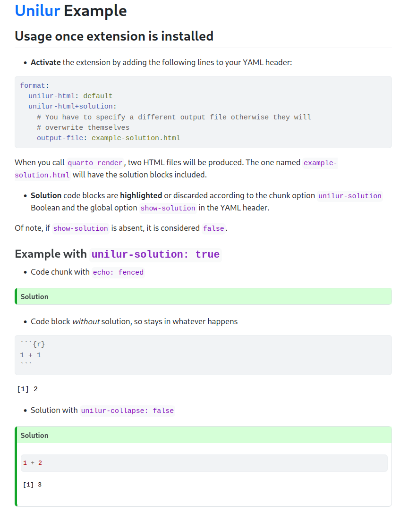
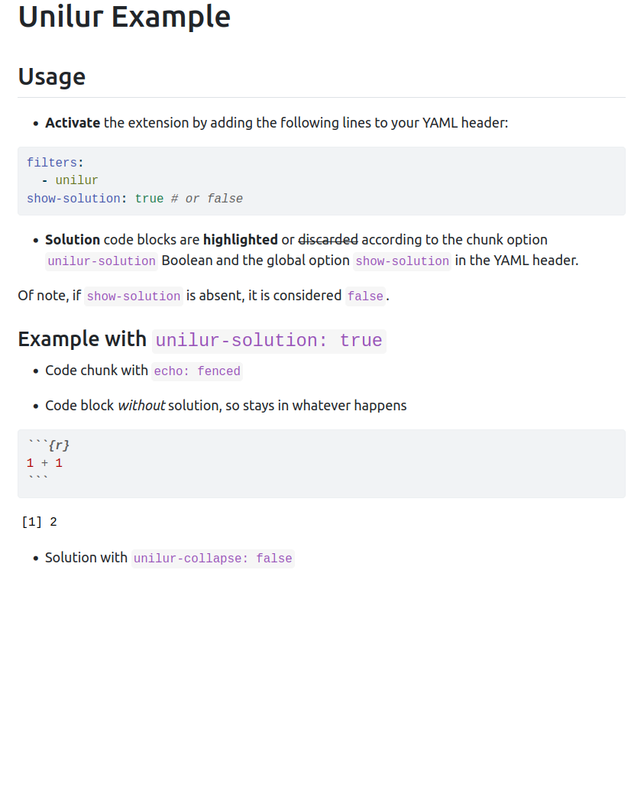

unilur
================


## Aim

Convert [{unilur}](https://github.com/koncina/unilur) developed by
[**Eric Koncina**](https://github.com/koncina) to a
[quarto-ext](https://github.com/quarto-ext). The current package does
more than the hiding/highlighting of **solution** code chunks for
teaching practicals.

## Installation

**Important**: this extension uses [custom AST](https://quarto.org/docs/prerelease/1.3/custom-ast-nodes/callout.html) only present with Quarto **>= 1.3** (see [release notes](https://quarto.org/docs/prerelease/1.3/))


``` bash
quarto install extension ginolhac/unilur
```

More details are available in Quarto docs for [managing
extensions](https://quarto.org/docs/extensions/#managing-extensions).

## Usage

- **Activate** the extension by adding the following lines to your YAML
  header:

``` yaml
filters:
  - unilur
```

- **Solution** code blocks are either **highlighted** or ~~discarded~~
  according to the `show-solution` Boolean and the YAML header:

``` yaml
show-solution: true # or false
```

- Add the new variable `unilur-solution` as [hashpipe,
  `#|`](https://quarto.org/docs/reference/cells/cells-knitr.html) to the
  code chunks that are part of practical answers. Otherwise, chunks are
  left untouched.

<!-- -->

    #| unilur-solution: true

Of note, if `show-solution` is absent, it is considered `false`.

Solution blocks are collapsed by default but can be shown with the chunk option `unilur-collapse` (see example below).


## Outputs

| Example `unilur-solution: true`   (file [`example.qmd`](https://github.com/ginolhac/unilur/blob/main/example.qmd))        | Example `unilur-solution: false`  (rendered: [`example.html`](https://ginolhac.github.io/unilur/example.html))   |
|---------------------------------------------|-------------------------------------------------|
|  |  |

## Acknowledgements

People who developed and released extensions I got inspiration from:

- [JJ Allaire](https://github.com/jjallaire) for
  [`filename`](https://github.com/quarto-ext/code-filename) extension
- [Andrie de Vries](https://github.com/andrie) for
  [`reveal-auto-agenda`](https://github.com/andrie/reveal-auto-agenda)
  extension

Moreover:

- [Christophe Dervieux](https://github.com/cderv) for precious advises and his precious time
- [Mickaël Canouil](https://github.com/mcanouil/) for maintaining the
  [awesome Quarto](https://github.com/mcanouil/awesome-quarto)


### TODO

- Add tests.
- GA to render the `example.qmd`.
- Remove the `unilur-solution: true` option from chunks when displayed (visible in `echo: fenced`).
- Create a custom callout (with icon), right now it is a CSS hack on the less used callout `caution`.

### Debugging

This helped me developing this extension.

### Get the `Pandoc` structure after the `lua` filter

Described [here in the docs](https://quarto.org/docs/extensions/lua.html#native-format)

``` yaml
format: native
```

Which returns something like this:

<details>
<summary>
pandoc AST
</summary>

``` 
Pandoc
  Meta
    { unMeta =
        fromList
          [ ( "biblio-config" , MetaBool True )
          , ( "labels"
            , MetaMap
                (fromList
                   [ ( "abstract" , MetaInlines [ Str "Abstract" ] )
                   , ( "affiliations"
                     , MetaInlines [ Str "Affiliations" ]
                     )
                   , ( "authors" , MetaInlines [ Str "Authors" ] )
                   , ( "description"
                     , MetaInlines [ Str "Description" ]
                     )
                   , ( "doi" , MetaInlines [ Str "Doi" ] )
                   , ( "modified" , MetaInlines [ Str "Modified" ] )
                   , ( "published" , MetaInlines [ Str "Published" ] )
                   ])
            )
          , ( "solution" , MetaBool True )
          , ( "title"
            , MetaInlines [ Str "Unilur" , Space , Str "Example" ]
            )
          ]
    }
  [ Header 2 ( "usage" , [] , [] ) [ Str "Usage" ]
  , BulletList
      [ [ Plain
            [ Strong [ Str "Activate" ]
            , Space
            , Str "the"
            , Space
            , Str "extension"
            , Space
            , Str "by"
            , Space
            , Str "adding"
            , Space
            , Str "the"
            , Space
            , Str "following"
            , Space
            , Str "lines"
            , Space
            , Str "to"
            , Space
            , Str "your"
            , Space
            , Str "YAML"
            , Space
            , Str "header:"
            ]
        ]
      ]
  , CodeBlock
      ( "" , [ "yaml" ] , [] ) "filters:\n  - unilur\n"
  , BulletList
      [ [ Plain
            [ Strong [ Str "Solution" ]
            , Space
            , Str "code"
            , Space
            , Str "blocks"
            , Space
            , Str "are"
            , Space
[...]
  , BulletList
      [ [ Plain
            [ Str "Solution"
            , Space
            , Str "with"
            , Space
            , Code ( "" , [] , [] ) "collapse: true"
            ]
        ]
      ]
  , Div
      ( "" , [ "cell" ] , [ ( "solution" , "true" ) ] )
      [ CodeBlock
          ( "" , [ "r" , "cell-code" ] , [] ) "1 + 2\n## [1] 3"
      ]
  ]
```

</details>

### To get the intermediate markdown document

    quarto render example.qmd -M keep-md:true

    /usr/lib/rstudio/resources/app/bin/quarto/bin/tools/pandoc -f markdown -t json -o ast.json example.md

Then visualize the Abstract Syntax Tree (AST) using [this
code](https://bookdown.org/yihui/rmarkdown-cookbook/lua-filters.html)

<details>
<summary>
pandoc AST
</summary>

``` r
xfun:::tree(
  jsonlite::fromJSON('ast.json', simplifyVector = FALSE)
)
```

``` markdown
List of 3
 |-pandoc-api-version:List of 3
 |  |-: int 1
 |  |-: int 22
 |  |-: int 2
 |-meta              :List of 5
 |  |-execute:List of 2
 |  |  |-t: chr "MetaMap"
 |  |  |-c:List of 1
 |  |     |-keep-md:List of 2
 |  |        |-t: chr "MetaBool"
 |  |        |-c: logi TRUE
 |  |-filters:List of 2
 |  |  |-t: chr "MetaList"
 |  |  |-c:List of 1
 |  |     |-:List of 2
 |  |        |-t: chr "MetaInlines"
 |  |        |-c:List of 1
 |  |           |-:List of 2
 |  |              |-t: chr "Str"
 |  |              |-c: chr "unilur"
 |  |-format :List of 2
 |  |  |-t: chr "MetaMap"
 |  |  |-c:List of 1
 |  |     |-html:List of 2
 |  |        |-t: chr "MetaMap"
 |  |        |-c:List of 1
 |  |           |-theme:List of 2
 |  |              |-t: chr "MetaInlines"
 |  |              |-c:List of 1
 |  |                 |-:List of 2
 |  |                    |-t: chr "Str"
 |  |                    |-c: chr "cosmo"
 |  |-title  :List of 2
 |  |  |-t: chr "MetaInlines"
 |  |  |-c:List of 3
 |  |     |-:List of 2
 |  |     |  |-t: chr "Str"
 |  |     |  |-c: chr "Unilur"
 |  |     |-:List of 1
 |  |     |  |-t: chr "Space"
 |  |     |-:List of 2
 |  |        |-t: chr "Str"
 |  |        |-c: chr "Example"
 |  |-unilur :List of 2
 |     |-t: chr "MetaMap"
 |     |-c:List of 1
 |        |-solution:List of 2
 |           |-t: chr "MetaInlines"
 |           |-c:List of 1
 |              |-:List of 2
 |                 |-t: chr "Str"
 |                 |-c: chr "true"
 |-blocks            :List of 5
    |-:List of 2
    |  |-t: chr "Div"
    |  |-c:List of 2
    |     |-:List of 3
    |     |  |-: chr ""
    |     |  |-:List of 1
    |     |  |  |-: chr "cell"
    |     |  |-:List of 1
    |     |     |-:List of 2
    |     |        |-: chr "solution"
    |     |        |-: chr "true"
    |     |-:List of 2
    |        |-:List of 2
    |        |  |-t: chr "CodeBlock"
    |        |  |-c:List of 2
    |        |     |-:List of 3
    |        |     |  |-: chr ""
    |        |     |  |-:List of 1
    |        |     |  |  |-: chr "cell-code"
    |        |     |  |-: list()
    |        |     |-: chr "```{r}\n#| solution: true\n\n1 + 1\n```"
    |        |-:List of 2
    |           |-t: chr "Div"
    |           |-c:List of 2
    |              |-:List of 3
    |              |  |-: chr ""
    |              |  |-:List of 2
    |              |  |  |-: chr "cell-output"
    |              |  |  |-: chr "cell-output-stdout"
    |              |  |-: list()
    |              |-:List of 1
    |                 |-:List of 2
    |                    |-t: chr "CodeBlock"
    |                    |-c:List of 2
    |                       |-:List of 3
    |                       |  |-: chr ""
    |                       |  |-: list()
    |                       |  |-: list()
    |                       |-: chr "[1] 2"
    |-:List of 2
    |  |-t: chr "Para"
    |  |-c:List of 1
    |     |-:List of 2
    |        |-t: chr "Str"
    |        |-c: chr "Classic"
    |-:List of 2
    |  |-t: chr "Div"
    |  |-c:List of 2
    |     |-:List of 3
    |     |  |-: chr ""
    |     |  |-:List of 1
    |     |  |  |-: chr "cell"
    |     |  |-: list()
    |     |-:List of 2
    |        |-:List of 2
    |        |  |-t: chr "CodeBlock"
    |        |  |-c:List of 2
    |        |     |-:List of 3
    |        |     |  |-: chr ""
    |        |     |  |-:List of 1
    |        |     |  |  |-: chr "cell-code"
    |        |     |  |-: list()
    |        |     |-: chr "```{r}\n1 + 1\n```"
    |        |-:List of 2
    |           |-t: chr "Div"
    |           |-c:List of 2
    |              |-:List of 3
    |              |  |-: chr ""
    |              |  |-:List of 2
    |              |  |  |-: chr "cell-output"
    |              |  |  |-: chr "cell-output-stdout"
    |              |  |-: list()
    |              |-:List of 1
    |                 |-:List of 2
    |                    |-t: chr "CodeBlock"
    |                    |-c:List of 2
    |                       |-:List of 3
    |                       |  |-: chr ""
    |                       |  |-: list()
    |                       |  |-: list()
    |                       |-: chr "[1] 2"
    |-:List of 2
    |  |-t: chr "Para"
    |  |-c:List of 1
    |     |-:List of 2
    |        |-t: chr "Str"
    |        |-c: chr "Solution"
    |-:List of 2
       |-t: chr "Div"
       |-c:List of 2
          |-:List of 3
          |  |-: chr ""
          |  |-:List of 1
          |  |  |-: chr "cell"
          |  |-:List of 1
          |     |-:List of 2
          |        |-: chr "solution"
          |        |-: chr "true"
          |-:List of 2
             |-:List of 2
             |  |-t: chr "CodeBlock"
             |  |-c:List of 2
             |     |-:List of 3
             |     |  |-: chr ""
             |     |  |-:List of 2
             |     |  |  |-: chr "r"
             |     |  |  |-: chr "cell-code"
             |     |  |-: list()
             |     |-: chr "1 + 2"
             |-:List of 2
                |-t: chr "Div"
                |-c:List of 2
                   |-:List of 3
                   |  |-: chr ""
                   |  |-:List of 2
                   |  |  |-: chr "cell-output"
                   |  |  |-: chr "cell-output-stdout"
                   |  |-: list()
                   |-:List of 1
                      |-:List of 2
                         |-t: chr "CodeBlock"
                         |-c:List of 2
                            |-:List of 3
                            |  |-: chr ""
                            |  |-: list()
                            |  |-: list()
                            |-: chr "[1] 3"
```

</details>

## License

MIT License
