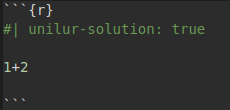
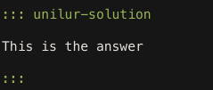
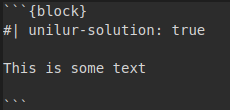
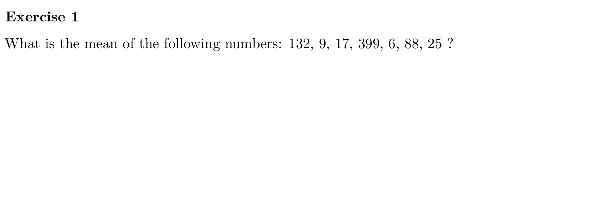
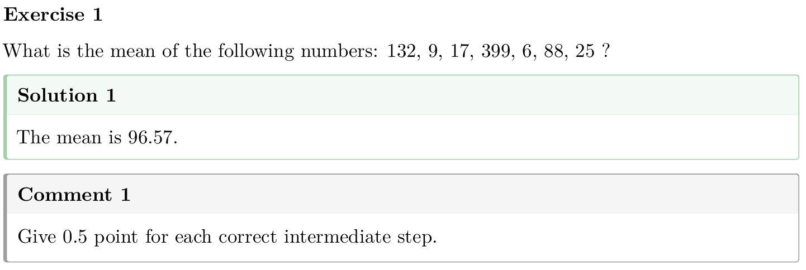

# unilur Extension for Quarto

:warning: this extension requires Quarto **>= 1.4.538** (current release: **1.7.32**). (if I am correct, please confirm and then delete that comment)

## What is `unilur`?

It is a [Quarto extension](https://github.com/quarto-ext), providing additional formatting options for Quarto documents. It is designed to help educators create tutorials, practicals, and exams (coming soon :wink:) with [Quarto](https://quarto.org/). With `unilur`, you can render from one single `.qmd` file:

- One file with only questions
- One file with questions and answers (and if used also comments), where answers appear in a coloured box (and comments in a different coloured box) 

It supports both HTML and PDF outputs and allows toggling the visibility of solutions (and comments) using a simple YAML switch. 


> **NOTE:** This [Quarto extension](https://github.com/quarto-ext) is a conversion/adaptation of the [{unilur} R package](https://github.com/koncina/unilur) for [rmarkdown](https://rmarkdown.rstudio.com/), which was developed by [**Eric Koncina**](https://github.com/koncina). ~~The current package does more than the hiding/highlighting of **solution** code chunks for
teaching practicals.~~


## Installation

**Prerequisites:** you need to have Quarto installed (see [here](https://quarto.org/docs/download/)). 

To use this extension in your Quarto project, run this in the top level of your Quarto project:

``` bash
quarto add ginolhac/unilur
```

This will install the extension under the `_extensions/` subdirectory. If you're using version control, you will want to check in this directory. You can find more information in the Quarto documentation for [managing
extensions](https://quarto.org/docs/extensions/#managing-extensions).


## Usage

:bulb: For a detailed explanation on how to use it, please see the vignette. (will add a complete step-by-step later if ok for you -> I will do it anyway for my colleagues)

To use the extension, you just need to add the following lines to your YAML header (you can use only HTML or PDF outputs):

``` yaml
format:
  unilur-html: default
  unilur-html+solution:
    output-file: example-solution.html
  unilur-pdf: default
  unilur-pdf+solution: default
```

The above code will give you four different files. Let's say that you have a Quarto file called [`example.qmd`](https://github.com/ginolhac/unilur/blob/main/example.qmd) after running:

``` bash
quarto render example.qmd
```


Then, you will get (you can click on each file to get an overview):

- [`example.html`](https://ginolhac.github.io/unilur/example.html): file with only the exercises in HTML format (the name of that file is the name of your `.qmd` file)
- [`example-solution.html`](https://ginolhac.github.io/unilur/example-solution.html): file with solutions (and comments if used) in HTML format (the name of that file was defined in the YAML section above)
- [`example.pdf`](https://ginolhac.github.io/unilur/example.pdf): file with only the exercises in PDF format (the name of that file is the name of your `.qmd` file)
- [`example+solution.pdf`](https://ginolhac.github.io/unilur/example-solution.pdf): file with solutions (and comments if used) in PDF format (the name of that file is the name of your `.qmd` file with `+solution` added automatically to it)


> **NOTE:** You have to specify a different output file for HTML, otherwise the solutions will be saved into the exercises file (overwrite themselves). Of course, it is possible to change the file name of all of the output files if wished.


### Exercises/instructions

You can use the the default prefix [`#exr-`](https://quarto.org/docs/authoring/cross-references.html) for writing your exercises. The extension made a slight modification to it in order to allow numbering the exercises without headers. By using it, you will have Exercise 1, Exercise 2, .... and not Exercise 1.1, Exercise 1.2, ... (default behavior with a header mandatory.

### Solutions

You have three different ways to show the solution to an exercise. 

| :one: Code chunks | :two: Fenced div | :three: Code Blocks |
|------------------------|---------------------|------------------------|
| Add the new variable `unilur-solution` as [hashpipe`#|`](https://quarto.org/docs/reference/cells/cells-knitr.html) to the code chunks that are part of practical answers. Otherwise, chunks are left untouched. | Fences divs can also be used, and they can contain code chunks too | Code Blocks are used for text |
|  |  | 


### Comments

The comments have the same three options as above for solutions. The only difference is to use `unilur-comment` instead of `unilur-solution`. The comments can be used for any additionnal information for the instructors, such as any general comments about a specific exercise or the points to be attributed for each answer (in the case of an exam for example). If you do not need it, you can skip it. If it is used, it will be shown in the same document as the solutions.


### Overview

> **NOTE:** in HTML, the solution and comment boxes are collapsed by default, but can be shown with the chunk option `unilur-collapse`.

| Exercise only  | Exercise with solution and comment   |
|---------------------------------------------|-------------------------------------------------|
|  |  |


> **NOTE:** The solutions coloured box is green. Thus, to avoid confusion, but also to homage of the original [{unilur} R package](https://github.com/koncina/unilur), the tip callout was changed to the colour yellow.


## Acknowledgements

People who developed and released extensions I got inspiration from:

- [JJ Allaire](https://github.com/jjallaire) for
  [`filename`](https://github.com/quarto-ext/code-filename) extension
- [Andrie de Vries](https://github.com/andrie) for
  [`reveal-auto-agenda`](https://github.com/andrie/reveal-auto-agenda)
  extension

Moreover:

- [Christophe Dervieux](https://github.com/cderv) for precious advises and his precious time
- [Mickaël Canouil](https://github.com/mcanouil/) for maintaining the
  [awesome Quarto](https://github.com/mcanouil/awesome-quarto)


## Contributing
We welcome contributions! Please submit a pull request or open an issue.


### TODO

- Add tests.
- callout-tip in yellow for PDF output
- Remove the `unilur-solution: true` option from chunks when displayed (visible in `echo: fenced`).
    + Idea from Christophe Dervieux: treat `div` attribute
    + Get `el` content and iterate with `walk()`
    + Add a filter `CodeBlock` which remove the `unilur` options

### Debugging

This helped me developing this extension.

### Get the `Pandoc` structure after the `lua` filter

Described [here in the docs](https://quarto.org/docs/extensions/lua.html#native-format)

``` yaml
format: native
```

Which returns something like this:

<details>
<summary>
pandoc AST
</summary>

``` 
Pandoc
  Meta
    { unMeta =
        fromList
          [ ( "biblio-config" , MetaBool True )
          , ( "labels"
            , MetaMap
                (fromList
                   [ ( "abstract" , MetaInlines [ Str "Abstract" ] )
                   , ( "affiliations"
                     , MetaInlines [ Str "Affiliations" ]
                     )
                   , ( "authors" , MetaInlines [ Str "Authors" ] )
                   , ( "description"
                     , MetaInlines [ Str "Description" ]
                     )
                   , ( "doi" , MetaInlines [ Str "Doi" ] )
                   , ( "modified" , MetaInlines [ Str "Modified" ] )
                   , ( "published" , MetaInlines [ Str "Published" ] )
                   ])
            )
          , ( "solution" , MetaBool True )
          , ( "title"
            , MetaInlines [ Str "Unilur" , Space , Str "Example" ]
            )
          ]
    }
  [ Header 2 ( "usage" , [] , [] ) [ Str "Usage" ]
  , BulletList
      [ [ Plain
            [ Strong [ Str "Activate" ]
            , Space
            , Str "the"
            , Space
            , Str "extension"
            , Space
            , Str "by"
            , Space
            , Str "adding"
            , Space
            , Str "the"
            , Space
            , Str "following"
            , Space
            , Str "lines"
            , Space
            , Str "to"
            , Space
            , Str "your"
            , Space
            , Str "YAML"
            , Space
            , Str "header:"
            ]
        ]
      ]
  , CodeBlock
      ( "" , [ "yaml" ] , [] ) "filters:\n  - unilur\n"
  , BulletList
      [ [ Plain
            [ Strong [ Str "Solution" ]
            , Space
            , Str "code"
            , Space
            , Str "blocks"
            , Space
            , Str "are"
            , Space
[...]
  , BulletList
      [ [ Plain
            [ Str "Solution"
            , Space
            , Str "with"
            , Space
            , Code ( "" , [] , [] ) "collapse: true"
            ]
        ]
      ]
  , Div
      ( "" , [ "cell" ] , [ ( "solution" , "true" ) ] )
      [ CodeBlock
          ( "" , [ "r" , "cell-code" ] , [] ) "1 + 2\n## [1] 3"
      ]
  ]
```

</details>

### To get the intermediate markdown document

    quarto render example.qmd -M keep-md:true

    /usr/lib/rstudio/resources/app/bin/quarto/bin/tools/pandoc -f markdown -t json -o ast.json example.md

Then visualize the Abstract Syntax Tree (AST) using [this
code](https://bookdown.org/yihui/rmarkdown-cookbook/lua-filters.html)

<details>
<summary>
pandoc AST
</summary>

``` r
xfun:::tree(
  jsonlite::fromJSON('ast.json', simplifyVector = FALSE)
)
```

``` markdown
List of 3
 |-pandoc-api-version:List of 3
 |  |-: int 1
 |  |-: int 22
 |  |-: int 2
 |-meta              :List of 5
 |  |-execute:List of 2
 |  |  |-t: chr "MetaMap"
 |  |  |-c:List of 1
 |  |     |-keep-md:List of 2
 |  |        |-t: chr "MetaBool"
 |  |        |-c: logi TRUE
 |  |-filters:List of 2
 |  |  |-t: chr "MetaList"
 |  |  |-c:List of 1
 |  |     |-:List of 2
 |  |        |-t: chr "MetaInlines"
 |  |        |-c:List of 1
 |  |           |-:List of 2
 |  |              |-t: chr "Str"
 |  |              |-c: chr "unilur"
 |  |-format :List of 2
 |  |  |-t: chr "MetaMap"
 |  |  |-c:List of 1
 |  |     |-html:List of 2
 |  |        |-t: chr "MetaMap"
 |  |        |-c:List of 1
 |  |           |-theme:List of 2
 |  |              |-t: chr "MetaInlines"
 |  |              |-c:List of 1
 |  |                 |-:List of 2
 |  |                    |-t: chr "Str"
 |  |                    |-c: chr "cosmo"
 |  |-title  :List of 2
 |  |  |-t: chr "MetaInlines"
 |  |  |-c:List of 3
 |  |     |-:List of 2
 |  |     |  |-t: chr "Str"
 |  |     |  |-c: chr "Unilur"
 |  |     |-:List of 1
 |  |     |  |-t: chr "Space"
 |  |     |-:List of 2
 |  |        |-t: chr "Str"
 |  |        |-c: chr "Example"
 |  |-unilur :List of 2
 |     |-t: chr "MetaMap"
 |     |-c:List of 1
 |        |-solution:List of 2
 |           |-t: chr "MetaInlines"
 |           |-c:List of 1
 |              |-:List of 2
 |                 |-t: chr "Str"
 |                 |-c: chr "true"
 |-blocks            :List of 5
    |-:List of 2
    |  |-t: chr "Div"
    |  |-c:List of 2
    |     |-:List of 3
    |     |  |-: chr ""
    |     |  |-:List of 1
    |     |  |  |-: chr "cell"
    |     |  |-:List of 1
    |     |     |-:List of 2
    |     |        |-: chr "solution"
    |     |        |-: chr "true"
    |     |-:List of 2
    |        |-:List of 2
    |        |  |-t: chr "CodeBlock"
    |        |  |-c:List of 2
    |        |     |-:List of 3
    |        |     |  |-: chr ""
    |        |     |  |-:List of 1
    |        |     |  |  |-: chr "cell-code"
    |        |     |  |-: list()
    |        |     |-: chr "```{r}\n#| solution: true\n\n1 + 1\n```"
    |        |-:List of 2
    |           |-t: chr "Div"
    |           |-c:List of 2
    |              |-:List of 3
    |              |  |-: chr ""
    |              |  |-:List of 2
    |              |  |  |-: chr "cell-output"
    |              |  |  |-: chr "cell-output-stdout"
    |              |  |-: list()
    |              |-:List of 1
    |                 |-:List of 2
    |                    |-t: chr "CodeBlock"
    |                    |-c:List of 2
    |                       |-:List of 3
    |                       |  |-: chr ""
    |                       |  |-: list()
    |                       |  |-: list()
    |                       |-: chr "[1] 2"
    |-:List of 2
    |  |-t: chr "Para"
    |  |-c:List of 1
    |     |-:List of 2
    |        |-t: chr "Str"
    |        |-c: chr "Classic"
    |-:List of 2
    |  |-t: chr "Div"
    |  |-c:List of 2
    |     |-:List of 3
    |     |  |-: chr ""
    |     |  |-:List of 1
    |     |  |  |-: chr "cell"
    |     |  |-: list()
    |     |-:List of 2
    |        |-:List of 2
    |        |  |-t: chr "CodeBlock"
    |        |  |-c:List of 2
    |        |     |-:List of 3
    |        |     |  |-: chr ""
    |        |     |  |-:List of 1
    |        |     |  |  |-: chr "cell-code"
    |        |     |  |-: list()
    |        |     |-: chr "```{r}\n1 + 1\n```"
    |        |-:List of 2
    |           |-t: chr "Div"
    |           |-c:List of 2
    |              |-:List of 3
    |              |  |-: chr ""
    |              |  |-:List of 2
    |              |  |  |-: chr "cell-output"
    |              |  |  |-: chr "cell-output-stdout"
    |              |  |-: list()
    |              |-:List of 1
    |                 |-:List of 2
    |                    |-t: chr "CodeBlock"
    |                    |-c:List of 2
    |                       |-:List of 3
    |                       |  |-: chr ""
    |                       |  |-: list()
    |                       |  |-: list()
    |                       |-: chr "[1] 2"
    |-:List of 2
    |  |-t: chr "Para"
    |  |-c:List of 1
    |     |-:List of 2
    |        |-t: chr "Str"
    |        |-c: chr "Solution"
    |-:List of 2
       |-t: chr "Div"
       |-c:List of 2
          |-:List of 3
          |  |-: chr ""
          |  |-:List of 1
          |  |  |-: chr "cell"
          |  |-:List of 1
          |     |-:List of 2
          |        |-: chr "solution"
          |        |-: chr "true"
          |-:List of 2
             |-:List of 2
             |  |-t: chr "CodeBlock"
             |  |-c:List of 2
             |     |-:List of 3
             |     |  |-: chr ""
             |     |  |-:List of 2
             |     |  |  |-: chr "r"
             |     |  |  |-: chr "cell-code"
             |     |  |-: list()
             |     |-: chr "1 + 2"
             |-:List of 2
                |-t: chr "Div"
                |-c:List of 2
                   |-:List of 3
                   |  |-: chr ""
                   |  |-:List of 2
                   |  |  |-: chr "cell-output"
                   |  |  |-: chr "cell-output-stdout"
                   |  |-: list()
                   |-:List of 1
                      |-:List of 2
                         |-t: chr "CodeBlock"
                         |-c:List of 2
                            |-:List of 3
                            |  |-: chr ""
                            |  |-: list()
                            |  |-: list()
                            |-: chr "[1] 3"
```

</details>

## License

MIT License
